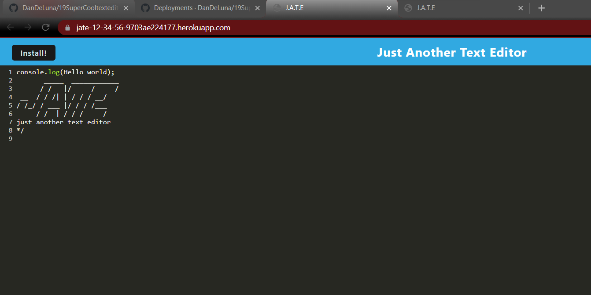

# 19 Progressive Web Applications (PWA): Text Editor

## Summary
Jate is a text editor app that allows you to write notes and can even be used offline. which can be very useful when it comes to takes notes without WIFI. JATE stands for Just Another Text Editor. 

## User Story

```md
AS A college student 
I WANT to create an app that allows me to take notes offline
So I can refer to them later
```


## Mock-Up




## Links 


## Instructions

* First clone this repository
* Second  type npm i
* Then type npm start and check to see this run on http://localhost:3000/

## License:
MIT


## Credits
* Myself


- - -

